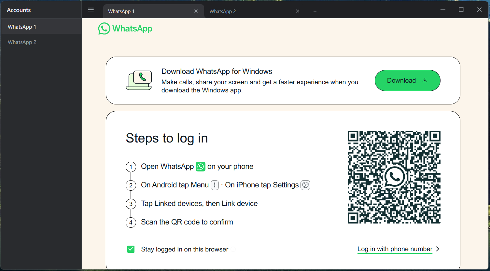

# Multi WhatsApp

A desktop application to manage multiple WhatsApp accounts simultaneously in a single window with isolated sessions.

<p align="center">
  
</p>

## Features

- **Multiple Accounts**: Run multiple WhatsApp Web instances with isolated sessions
- **Tab Management**: Chrome-like tabs with drag-and-drop reordering
- **Session Persistence**: Tabs and login sessions persist across restarts
- **Custom Tab Names**: Double-click or right-click to rename tabs
- **Tab Colors**: Right-click to assign custom colors to tabs for easy identification
- **Native Notifications**: Uses WhatsApp Web's built-in notifications
- **Dark/Light Mode**: Follows system theme
- **Keyboard Shortcuts**: `Ctrl+Tab` / `Ctrl+Shift+Tab` to switch tabs / `Ctrl+'` to open/close sidebar
- **Context Menu**: Right-click for Rename, Refresh, Mute/Unmute, Change Color, Clear Session, Close
- **Zoom Controls**: `Ctrl +` / `Ctrl -` / `Ctrl 0` to zoom in/out/reset the active tab
- **Close Confirmation**: Optional confirmation dialog when closing tabs to prevent accidental session loss

## Installation

```bash
git clone https://github.com/0xda203/multi-whatsapp.git
cd multi-whatsapp
npm install
npm start
```

## Build

```bash
npm run make
```

Output: `out/make/squirrel.windows/x64/`

## Usage

1. Launch the app
2. Scan QR code with your WhatsApp
3. Click `+` to add more accounts
4. Enable notifications: WhatsApp menu → Settings → Notifications → Enable desktop notifications

## Keyboard Shortcuts

| Shortcut | Action |
|----------|--------|
| `Ctrl+Tab` | Next tab |
| `Ctrl+Shift+Tab` | Previous tab |
| `Ctrl+'` | Open/Close sidebar |
| `Ctrl +` | Zoom In (Active Tab) |
| `Ctrl -` | Zoom Out (Active Tab) |

## Limitations

- Requires internet connection
- Phone must stay connected for WhatsApp Web to work

## License

MIT